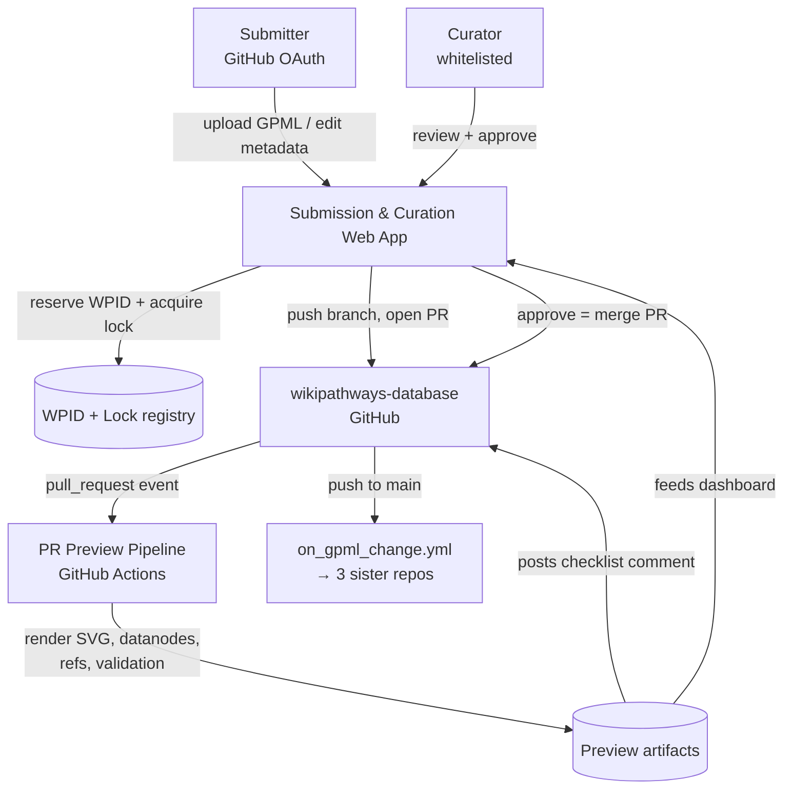

# Proposal: A submission & curation workflow for GitHub-based WikiPathways

**Status:** Draft for discussion
**Author:** Marvin Martens
**Scope:** A **new repository under the `wikipathways` org** (the submission & curation app),
plus a small PR-preview workflow added to `wikipathways/wikipathways-database`
**Date:** 2026-07-24

---

## 1. Context & problem

WikiPathways content is now fully GitHub-based: every new pathway and every edit is a
pull request against `wikipathways/wikipathways-database`. There is **no purpose-built
interface** for submitting or curating pathways, and the old authoring path is gone —
the PathVisio 3 WikiPathways plugins are non-functional and PathVisio 4 is a separate
effort we are not touching. In practice the raw GitHub PR flow is the only door, and it
serves neither submitters nor curators well.

### What the last ~3 months of PRs actually show

A review of 51 PRs (38 merged, 10 closed-unmerged, 3 open) surfaces five recurring
failures:

1. **Reviewers approve unreadable XML.** The artifacts that make a pathway reviewable —
   the rendered SVG, `-datanodes.tsv`, `-bibliography.tsv` — are only generated *after*
   merge to `main` (`on_gpml_change.yml` triggers on push to `main`, not on PRs). Almost
   every PR shows `checks(0)`: no validation, no visual, no metadata preview. Curators are
   asked to sign off on a raw GPML diff.
2. **Nobody uses the merge button.** Merges are manual and out-of-band — "Manually merged
   in" (#75, #78), "Merged in." (#94) — because clicking merge either fails or triggers the
   heavy pipeline messily.
3. **Concurrent GPML edits are unmergeable.** #90 is the canonical failure: repeated
   conflict-resolution attempts, declared "too complex," abandoned, and reopened as a
   clean-branch #93. GPML is XML plus layout; it does not line-merge.
4. **New pathways arrive malformed.** #94 came in as `ketogenic in epilepstogenesis.gpml` —
   no WPID, wrong filename, not under `pathways/WP<id>/`. #78 used a `WP699__PR78` naming
   hack. Someone manually assigns a WPID and restructures every new submission.
5. **WPID collisions are already happening.** Highest *merged* WPID is **WP5636**, but
   **WP5637, WP5638, WP5639, WP5641** are all reserved in unmerged PRs. "Next = highest in
   the tree + 1" is already off by four.

**Root cause:** the GitHub PR is the wrong altitude for both roles. Submitters fight git
and XML; curators cannot see what they are approving because the reviewable artifacts do
not exist until after merge.

---

## 2. Goals & non-goals

**Goals**
- A low-friction door for **anyone** to submit a new pathway or an update, without running
  git locally.
- Automatic **WPID assignment, file naming, and directory layout** — malformed submissions
  become impossible.
- Make PRs **reviewable**: rendered pathway, data-node/reference tables, and validation
  visible *before* merge.
- **Structurally prevent** the unmergeable-conflict situation rather than resolving it after
  the fact.
- Spread curation load across the **~20-person curator pool** with a real review UI and
  checklists.
- Preserve **git provenance** and the existing cascade into the three sister repos.

**Non-goals (for now)**
- Building an in-browser GPML *editor*. Authoring stays in desktop tools (PathVisio 4 later);
  the app handles upload + metadata + preview + submission, not graphical editing.
- Touching PathVisio 3/4.
- Changing the downstream `on_gpml_change.yml` cascade semantics — we *extend* it to run on
  PRs, we do not rewrite it.

---

## 3. Design overview

A **hosted web app** — developed in its **own new repository under the `wikipathways` org**
(the whole app, dashboard, registry, and GitHub App identity live there; `wikipathways-database`
stays a content repo) — is the single front door for both new pathways and updates. It
authenticates submitters with **GitHub OAuth** and acts on their behalf, so a contributor
authorizes the app once and never touches git — the app creates the branch, commits, and opens
a **real GitHub PR against `wikipathways-database`**. Every submission is therefore a normal PR
with full provenance and the intact sister-repo cascade.

### Repo boundary — what lives where

| New app repo (`wikipathways/<app>`) | `wikipathways-database` |
|---|---|
| Web app (submit + update flows), GitHub OAuth | The GPML content + existing `on_gpml_change.yml` cascade (unchanged) |
| Curation dashboard | **One added workflow**: render + validation on `pull_request`, posting the preview artifact/comment |
| WPID allocator + pathway-lock registry (datastore) | — |
| GitHub App / bot manifest, curator-whitelist config | Optionally the curator whitelist, if kept as a repo-tracked file here |
| Deployment (Dockerfile, CI → GHCR, cluster service) | — |

The app talks to `wikipathways-database` purely through the GitHub API as an external client;
the only code that ships *into* the content repo is the PR-preview workflow (MVP-1).

Three services back the app, all conventional cluster services:

**Two roles:**
- **Submitter** — anyone with a GitHub login. Can create/update pathways via the app.
- **Curator** — a whitelist of ~20 people. Only curators can approve/merge.

**Review happens in two venues that share one source of truth:** the **app curation
dashboard is the reviewer's home** (side-by-side before/after render, structured checklist,
one-click approve-that-merges), and the app **mirrors** the same rendered preview +
checklist as a **read-only PR comment** on GitHub for people who live there. Approval state
is owned by the app so the two venues never diverge.

---

## 4. Components

### 4.1 Web submission app

- **Auth:** GitHub OAuth. The app holds a token scoped to push branches and open PRs on the
  user's behalf. Because the *app* does the git mechanics, the git-friction drop-off
  (fresh-branch workarounds in #90/#93, wrong filenames in #94) disappears while authorship
  stays attributed to the real GitHub user.
- **New pathway flow:** upload GPML (exported from a desktop tool) → app validates → app
  reserves next WPID → renames to `WP<id>.gpml`, creates `pathways/WP<id>/` → opens PR.
- **Update flow:** pick an existing pathway → app acquires the pathway lock (§4.3) →
  user uploads the revised GPML → app opens/updates the PR on a branch off the latest `main`.
- **Metadata assist:** collect description, organism, authors (feeding `author_list.csv`),
  ontology tags — the things `create_pathway_frontmatter.py` and `meta-data-action` need,
  captured at source instead of reconstructed later.

### 4.2 WPID allocator (atomic)

- Next ID = **1 + max(WPID)** over **repo tree ∪ open PRs ∪ in-flight reservations**. The
  union is essential: today's collisions come from reading only the merged tree.
- Reservation is **atomic** — recorded in the registry (§4.3) at the moment of allocation,
  before the PR exists, so two simultaneous new-pathway submissions cannot receive the same
  ID. A reservation that never becomes a merged PR expires and the ID is returned to the pool.

### 4.3 Pathway check-out lock

- **One open edit per pathway at a time.** Acquiring a lock is what lets a submitter start an
  update; it structurally prevents the #90 conflict entirely.
- **The lock cannot assume it is the only writer.** Power users may still open a raw GitHub
  PR directly, bypassing the app. So on check-out the app must also **scan GitHub for an open
  PR touching that pathway** and refuse if one exists.
- **Locks auto-expire** (e.g. after N days of inactivity or on PR close/merge) and a curator
  can **force-release**, so an abandoned check-out never becomes a silent permanent block.
- The lock registry, WPID reservations, and curator whitelist can share one small datastore
  behind the app.

### 4.4 PR preview pipeline — *the highest-leverage change*

- Extend the existing render/metadata jobs to run on **`pull_request`**, not only on push to
  `main`, writing to a **preview artifact** rather than committing derived files.
- Produces, per PR: **rendered SVG**, `-datanodes.tsv`, `-bibliography.tsv`, and a
  **validation report** (schema sanity, empty `<bp:ID>` → NA, missing identifiers, broken
  refs — the classes of problem seen in #78's `frontmatter`/`json-svg` failures).
- This is mostly **re-pointing and re-targeting `on_gpml_change.yml`**, not new pipeline
  logic — the generators already exist.

### 4.5 Curation dashboard + augmented PR mirror

- **Dashboard (reviewer home):** queue of open submissions; for each, a **before/after
  rendered view**, the data-node/reference/validation tables, a **structured curation
  checklist**, and **approve → merge**. Reduces reviewer load and makes sign-off auditable.
- **Augmented PR comment (mirror):** the same rendered preview + checklist posted to the PR,
  **read-only**, for curators who prefer GitHub. Approval still flows through the app so the
  two venues cannot disagree.
- **Assignment:** auto-suggest reviewers (e.g. by organism/community/prior authorship) to
  avoid everything landing on 2–3 people, as it does now.

---

## 5. Conflict / merge model

- **GPML is the single source of truth and is never line-merged.** Derived files
  (`*-info.json`, `*.json`, `*.md`, `*.tsv`, `*-thumb.png`) are regenerated, never
  hand-reconciled.
- **Check-out lock (§4.3)** makes concurrent edits to one pathway impossible by construction,
  so the "two divergent GPMLs" case that killed #90 cannot arise from the app.
- Update branches are always cut **from the latest `main`**, so a merged PR never leaves a
  later PR rebasing across an XML conflict.

---

## 6. How this resolves each named pain

| Pain (from the PR audit) | Resolved by |
|---|---|
| Reviewers approve unreadable XML | §4.4 PR preview + §4.5 dashboard render |
| Manual out-of-band merges | §4.5 approve-that-merges; PR is green because previews ran |
| Unmergeable concurrent edits (#90) | §4.3 lock + §5 no-XML-merge / branch-off-latest |
| Malformed new pathways (#94) | §4.1 app-owned naming/layout + §4.2 allocator |
| WPID collisions (WP5637–5641) | §4.2 atomic allocator over tree ∪ open PRs |
| Curation load on 2–3 people | §4.5 dashboard, checklist, reviewer auto-assign; curator whitelist |

---

## 7. Hosting & implementation notes

- The app is a **new repo under the `wikipathways` org**, built and deployed independently of
  the content repo. Suggested names: `wikipathways-curator`, `wikipathways-submit`, or
  `pathway-portal` (pick one before scaffolding).
- Deploy as a standard cluster service (Traefik-routed `*.cloud.vhp4safety.nl` or a
  `*.wikipathways.org` subdomain), GlusterFS-backed datastore for the WPID/lock registry,
  image built by the app repo's CI → GHCR so both swarm nodes can pull. Follows the cluster
  conventions already in use.
- The app needs a **GitHub App / bot identity** installed on `wikipathways-database` with
  rights to push branches, open PRs, post comments, and merge. Merges by the bot must not
  fight the existing `on_gpml_change.yml` cascade — approval simply merges to `main` and the
  current pipeline takes over unchanged.
- **Curator whitelist (~20)** can live as a GitHub Team or a repo-tracked config the app
  reads; either keeps it transparent and reviewable. If repo-tracked, it can sit in either
  repo — putting it in the app repo keeps all app config together.

---

## 8. Suggested phasing

1. **MVP-1 — Reviewability (biggest win, smallest build) — lands in `wikipathways-database`:**
   run the render + validation pipeline on `pull_request` and post the preview/checklist as a
   PR comment. Delivers value with *zero* app and no new repo: curators can finally see what
   they approve, even on today's raw PRs.
2. **MVP-2 — Submission app, new pathways — new app repo:** scaffold the repo, OAuth login,
   upload, atomic WPID allocation, naming/layout, PR creation. Kills the malformed-submission
   and collision classes.
3. **MVP-3 — Updates + lock — app repo:** check-out lock, update flow, branch-off-latest.
4. **MVP-4 — Curation dashboard — app repo:** reviewer home, before/after render, checklist,
   approve-that-merges, reviewer assignment.

Each phase is independently useful and independently shippable. MVP-1 can proceed immediately
and in parallel with standing up the new repo.

---

## 9. Open questions / risks

- **Curator whitelist mechanism:** GitHub Team vs repo-tracked file — needs a decision.
- **Bot merge vs branch protection:** if `main` gets required-review branch protection, the
  bot's approve-merge must satisfy it; confirm the desired protection rules.
- **Preview cost/time:** the full pipeline is ~8 jobs; the PR preview should run only the
  subset needed for review (render + datanodes + refs + validation), not the sister-repo
  pushes.
- **Reservation expiry policy:** exact lock/reservation TTLs need tuning against real
  submitter behaviour.
- **Raw-PR power users:** the app tolerates them but cannot lock them; is that acceptable, or
  should direct PRs eventually be discouraged in favour of the app?

---

## Appendix: evidence base

- Highest merged WPID: **WP5636**; reserved-but-unmerged: **WP5637, WP5638, WP5639, WP5641**.
- Repo contains **2085** `pathways/WP*` directories.
- Representative PRs: **#90/#93** (conflict abandonment → clean rebranch), **#94** (malformed
  new-pathway filename, no WPID), **#78** (`frontmatter`/`json-svg` failures, only PR with
  checks running — via a sandbox experiment), **#75** (manual merge). Merged-PR median
  time-to-merge 5.3 h but mean 99.6 h (long tail of stuck reviews).
